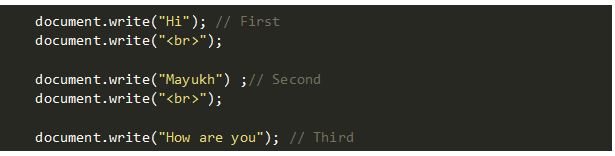

   

     Synchronous JavaScript: As the name suggests synchronous means to be in a sequence, i.e. 
     
     every statement of the code gets executed one by one. So, basically a statement has to 
     
     wait for the earlier statement to get executed.

   

      Autput:

   

     Asynchronous JavaScript: Asynchronous code allows the program to be executed immediately 
     
     where the synchronous code will block further execution of the remaining code until it 
     
     finishes the current one

   ;

   

     Differences. 

     Synchronous

     1. Instruction in Synchronous code execution in a given sequence;
     
     2. Each operation waits for the previous operations executed;
     
     3. Most of the time JavaScript is used as Synchronous code;

     Asynchronous
     
     1. Instruction in Asynchronous code can executed in parallel;
     
     2. Next operations can occur while the previous operation is still getting processed;
     
     3. Asynchronous JavaScript is preferred in situation , which execution gets blocked indefinitly;

### setTimeout();

     The setTimeout() method executes a block of code after the specified time. The method 
     
     executes the code only once.   Syntaxs:

   

          Its parameters are:

              -- function - a function containing a block of code
          
              -- milliseconds - the time after which the function is executed

   ;

   
### setInterval()

     The setInterval() method helps us to repeatedly execute a function after a fixed delay. It 
     
     returns a unique interval ID which can later be used by the clearInterval() method which 
     
     stops further repeated execution of the function. 

   

     where,
          
         -- func is the function that we want to execute repeatedly after delay milliseconds.
         
         -- delay (optional parameter) is the number of milliseconds delay between two repeated execution of the function.
         
         -- arg1, …, argN (optional parameter) are the arguments that will be passed to func when it is executed.

### Callback function

      A callback function is a function passed into another function as an argument, which is 
      
      then invoked inside the outer function to complete some kind of routine or action.

      Many JavaScript methods accept a function as an argument.

         1. Array.forEach() accepts a function that runs on each item in an array
         
         2. Element.addEventListener() accepts a function that runs whenever the specified event is triggered
         
         3. Promise.then() accepts a function that runs when the Promise resolves

   ;

   ;

### Promise()

     In JavaScript, a promise is a good way to handle asynchronous operations. It is
     
     used to find out if the asynchronous operation is successfully completed or not.
     
     Syntax:
img 14
     States of a Promise
 
         Pending - When you newly create a promise it will be pending
         
         Fulfilled / Resolved - When a promise has been resolved
         
         Rejected - When an error occured and the promised value can't be determined

     Essentially resolve should be called when a task has been successfully fulfilled and 
     
     reject should be called if the task has failed.

img 15

### API
     API (Application Programming Interface) can be considered as a set of rules that are 
     
     shared by a particular service. These rules determine in which format and with which 
     
     command set your application can access the service, as well as what data this service can 
     
     return in a response. API acts as a layer between your application and external service.
     
     REST API

     REST API (Representational state transfer) is an API that uses HTTP requests for 
     
     communication with web services and must comply with certain constraints. Full constraints 
     
     list can be viewed at the link. Here are some of them:

     CRUD and types of requests
     
     CRUD is a programming concept denoting four basic actions (create, read, update, and 
     
     delete) that can be performed on a data source. In a REST API, these actions correspond to 
     
     Types of Requests or Request Methods:

         1. POST: Create action. Adds new data to the server. Using this type of request, you 
         
         can, for example, add a new ticket to your inventory.

img 16

         2. GET: Read action. Retrieves information (like a list of items). This is the most 
         
         common type of request. Using it, we can get the data we are interested in from those 
         
         that the API is ready to share.
img 17
         
         3. PUT: Update action. Changes existing information. For example, using this type of 
         
         request, it would be possible to change the color or value of an existing product.
img 18

         4.DELETE: Delete action. Deletes existing information.
img 19

### fetch()

     The fetch() method in JavaScript is used to request data from a server. The request can be 
     
     of any type of API that returns the data in JSON or XML. The fetch() method requires one 
     
     parameter, the URL to request, and returns a promise

img 20
